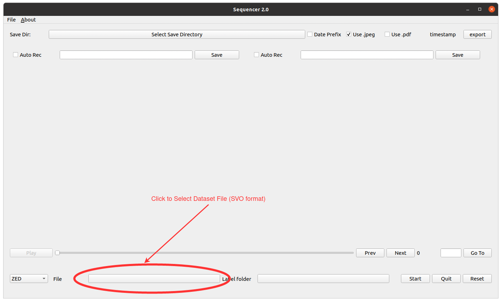
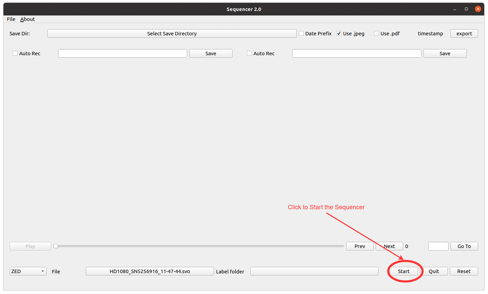
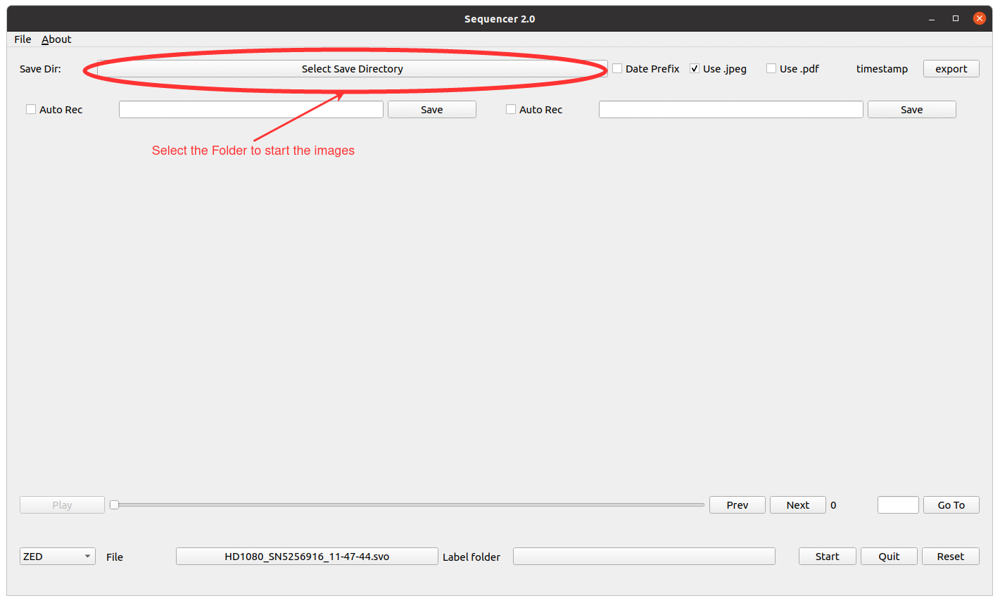
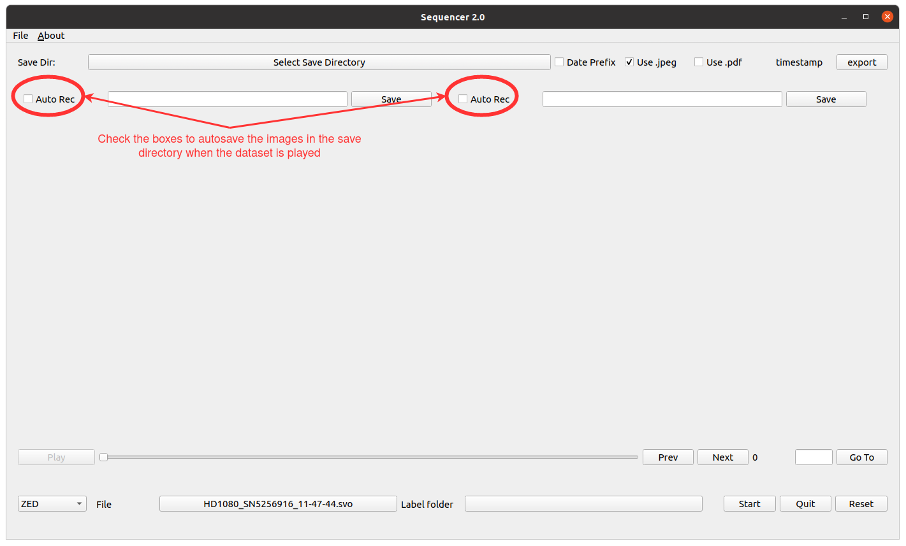
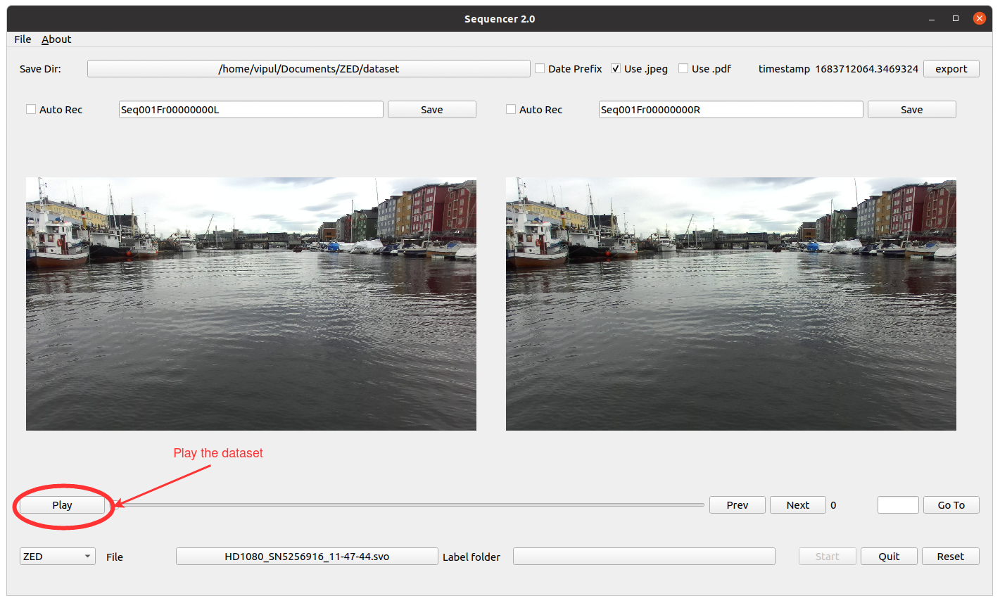
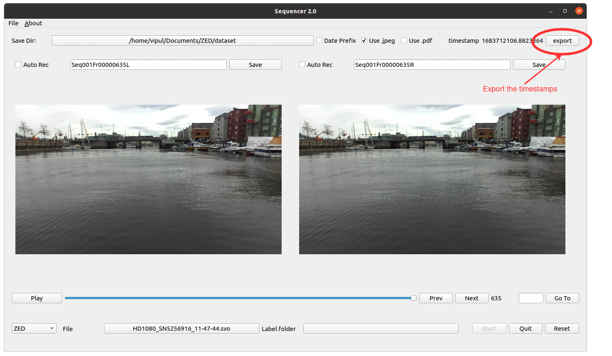
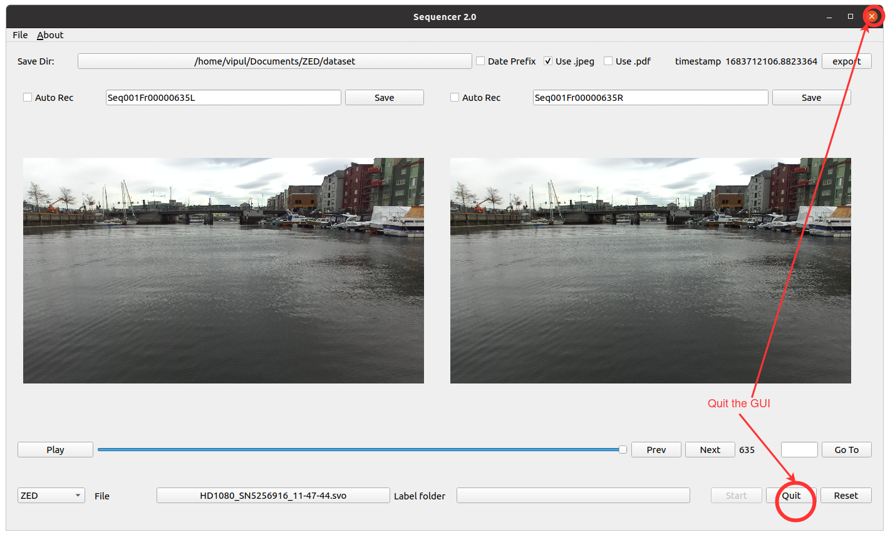

# GUI
This project is intended to visualize the intermediate results from a computer vision pipeline. It is able to handle SVO dataset files from ZED camera as well as KITTI dataset. Currently, this is very unstable and need further devlopment to be completely utilised in any computer vision project. 

## Samples
I have provided one sample file for the zed camera called [zed_sample](samples/zed_sample.py)  that can be used to interfaced with the GUI. There are a lot of functions that the GUI provide and can be interfaced with the handling script but for the dataset creation purpose, I will be focusing on the following 

- Toggle between rectified and unrectified images:
  ZED sample uses a ZED camera object to handle the svo files and interface it with the GUI. The arguement ```use_rectified : bool``` can be passed to this class while creating the camera object.

- File name:
  The GUI request the handling script to the return the image to be displaced. Along with the image, a name can be passed as well. This name will be used to save the images in auto_record mode. Function ```return_left_image``` and ```return_right_image``` can be used to modify the file names in the [zed_sample](samples/zed_sample.py)

## Create Images Dataset Using GUI for ZED Camera
This functionality is fully tested and working if the steps are followed in the given sequence only. If the steps are followed exactly, you will have all the left and right images in a folder (all images except the first image that is frame 0), however, the timestamp file will have all the timestamps including the timestamp for frame 0. The following sample takes left and right rectified images from the zed camera and display it in the GUI.

- Run the application
  ```
  python3 -m samples.zed_sample
  ```
- Select the SVO filepath.

  
- Start the Player.

  
- Select the directory in which the images will be saved.

  
- Enable the auto recording of the images while playing.

  
- Play the Sequencer. Play button will automatically be toggle to Pause. 

  
- Export the timestamps when the file reached to the end. Pause button will automatically be toggle to Play again

  
- Quit the GUI and launch it again to prepare new dataset. Button Reset doesn't work properly at this moment. 

  

## Caution
This package is not stable and can throw warnings in some cases.

If the application is hanged for some reason, then the app can be closed by pressing the x button in the upper right corner. If this still doesn't close it, then in a few seconds Force Quit will appear and that can be used to close the application. 